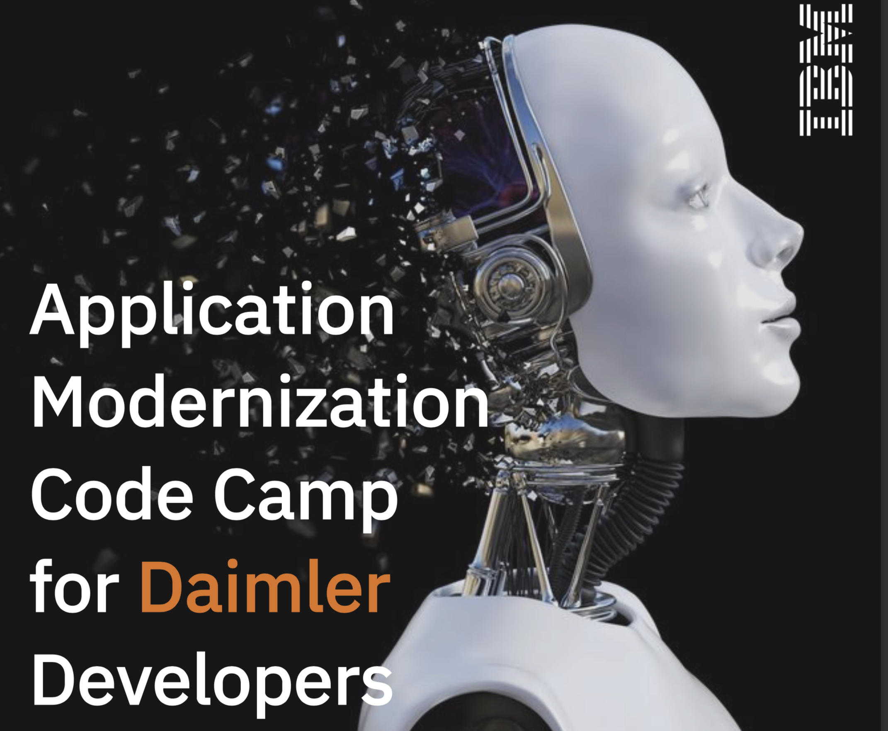

## Application Modernization Code Camp

Welcome to our workshop! In this workshop you will gain practical skills about application modernization, migration tools and approaches and potential target runtimes.

The workshop will include coverage of 12-factor apps, Microservices as well as Kubernetes and Docker environments all running on [IBM Cloud Pak for Applications](https://www.ibm.com/cloud/cloud-pak-for-applications/get-started) powered by [OpenShift 4](https://blog.openshift.com/introducing-red-hat-openshift-4/).

   

The introductory page of the workshop is broken down into the following sections:

* [Agenda](#agenda)
* [Compatibility](#compatibility)
* [Credits](#credits)

## Agenda

|  Agenda |
| - |
| [Lecture: Introduction](https://ibm.box.com/s/m0j3rh23hqdocp16f6388cc6qelu19wa) |
| [Lecture: Docker & Kubernetes Overview & Demo](https://ibm.box.com/s/882r368rk8k3hq8nmk37gugkw5mtn4c0) |
| [Lecture: Microservices – Principles, Patterns and Implementation](https://ibm.box.com/s/fajeb3hwsb1qk44b4l8ttowp0s2vbfvt) |
| [Pre-work: Verifying access to WeTTy, OpenShift 4 and IBM Cloud Transformation Advisor](exercise-0/README.md)  |
| [Hands on Lab: Deploy Microservice Application](exercise-1/README.md)
| [Lecture: 12 Factor Apps – Methodology Overview and Common Violations in classic JEE applications](https://ibm.box.com/s/uzq2l30d85mucfd29aiucc2fyxxelxoq) |
| [Lecture: Application Modernization & Migration Approaches](https://ibm.box.com/s/9uddrywgwp1y2d0r7ouq5kvuwge889de) |
| [Hands on Lab: Run Transformation Advisor against WebSphere app](exercise-2/README.md) |
| [Lecture: Load Balancing JaveEE Apps in OpenShift](https://ibm.box.com/s/s0r7qvyxdjs8iih6formt5hjwa98ofgf) |
| [Hands on Lab: Load Balancing JEE Apps – HttpSession Replication in Openshift](exercise-3/README.md)

## Compatibility

This workshop has been tested on the following platforms:

| Operating System | Browser |
| - | - |
| **macOS**: Mojave (10.14) | **Chrome** 79.0.3945.130 |

## Credits

This workshop was primarily written by [David Carew](https://developer.ibm.com/profiles/carew) and [John Zaccone](https://developer.ibm.com/profiles/john.zaccone). Many other IBMers have contributed to refine, extend and test the workshop material.

* [Oliver Rodriguez](https://developer.ibm.com/profiles/odrodrig)
* [Lee Zhang](https://developer.ibm.com/profiles/lijing)
* [Tim Robinson](https://developer.ibm.com/profiles/timro)
* [Javier Torres](https://github.com/jrtorres)
* [Rojan Jose](https://github.com/rojanjose)
