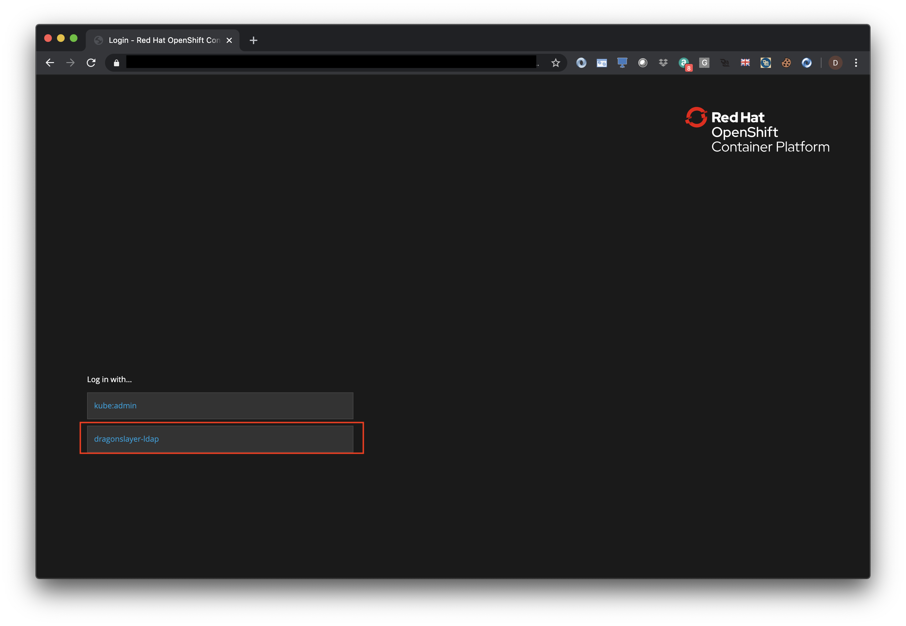

# Pre-work

This section is broken up into the following steps:

1. [Accessing WeTTy](#1-accessing-wetty)
1. [Accessing the OpenShift console](#2-accessing-the-openshift-4-console)
1. [Accessing IBM Cloud Transformation Advisor](#3-accessing-ibm-cloud-transformation-advisor)

## 1. Accessing WeTTy

Various parts of this workshop will require access to the OpenShift 4 CLI. In order to minimize student laptop setup requirements
an Ubuntu 18.04 VM has been setup for the use of the students. Access to that VM is provided via [WeTTy](https://github.com/butlerx/wetty) a browser based terminal emulator written entirely in JavaScript.

1.1 Verify that you can access the WeTTy terminal using the URL provided to you by your instructor.

   

1.2 Verify that you can login with the credentials provided to you by your instructors

   

## 2. Accessing the OpenShift 4 console

Various parts of this workshop will require access to the OpenShift 4 console.

2.1 Verify that you can access the OpenShift console using the URL provided to you by your instructors.

   

2.2 You will then be asked to log in with either `kube:admin` or `dragonslayer-ldap`. Select `dragonslayer-ldap` and log in using the same credentials you used to login to WeTTy.

   

## 3. Accessing IBM Cloud Transformation Advisor

This workshop will require access to IBM Cloud Transformation Advisor installed on OpenShift 4.

3.1 Verify that you can access IBM Cloud Transformation Advisor using the URL provided to you by your instructors. If you are presented with the OpenShift 4 console login screen, login as instructed in the previous step.

   
