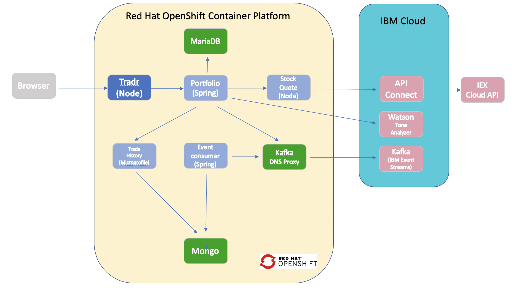
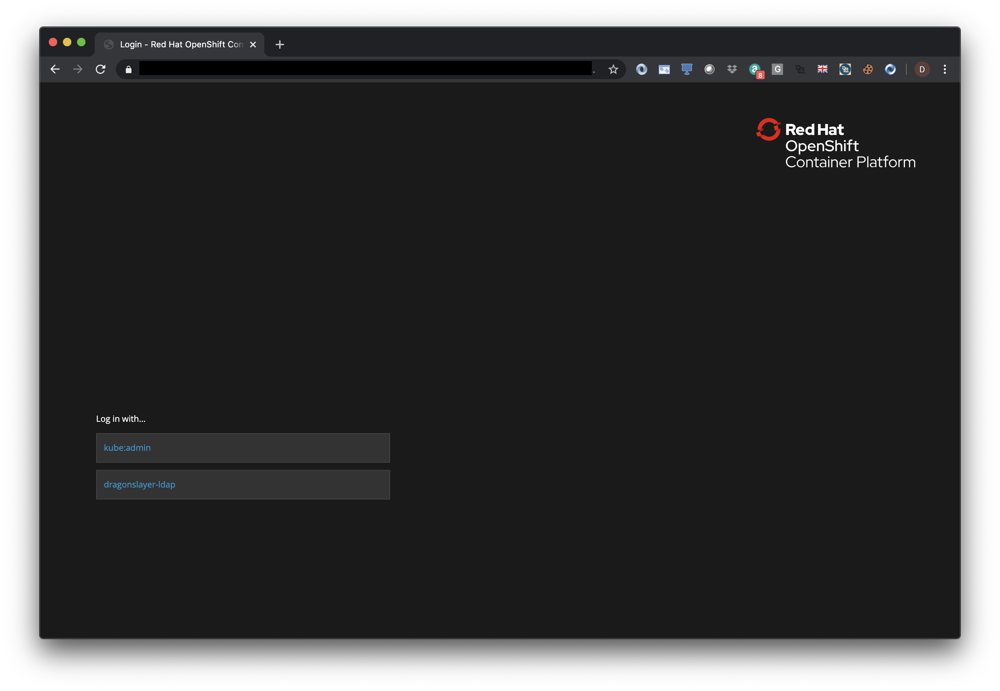
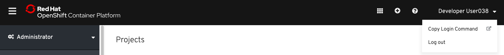
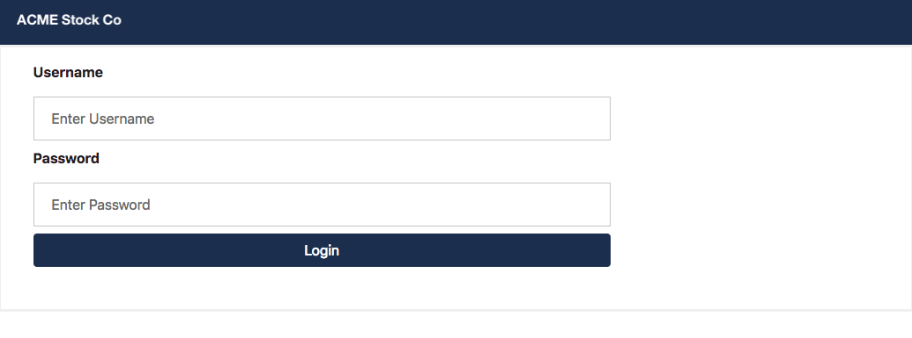
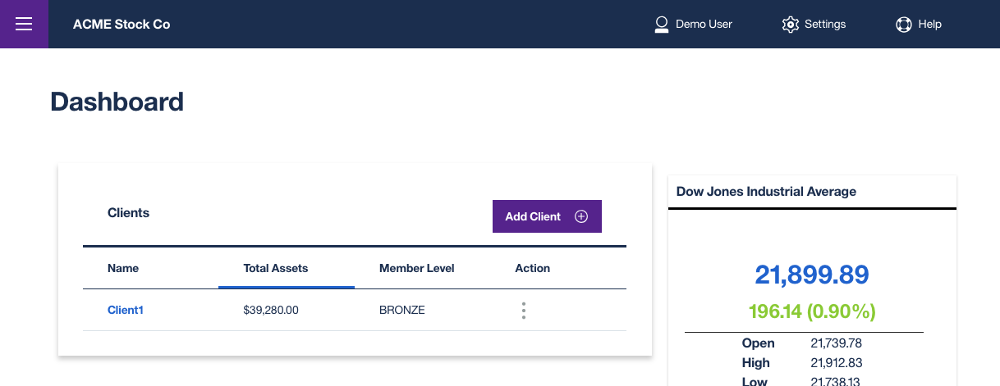
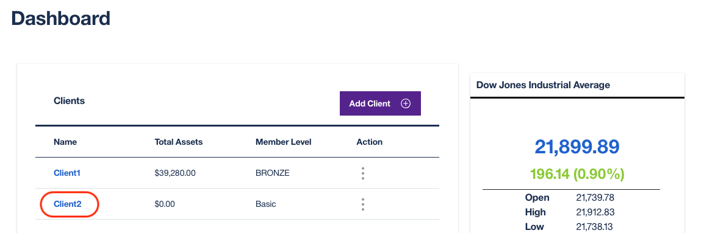
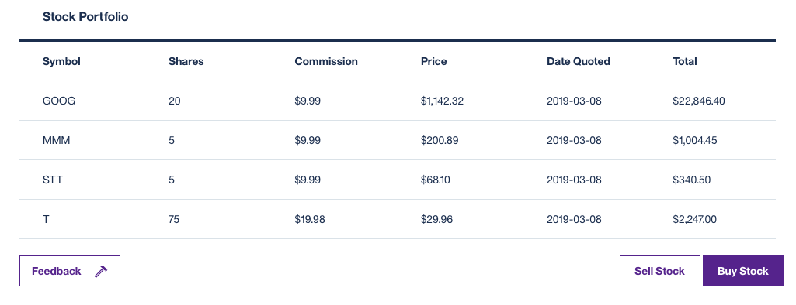
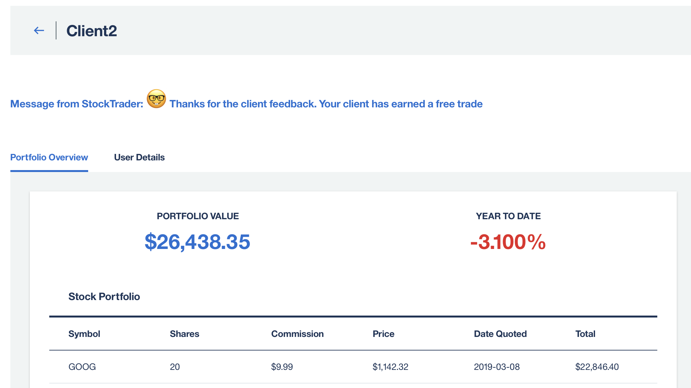
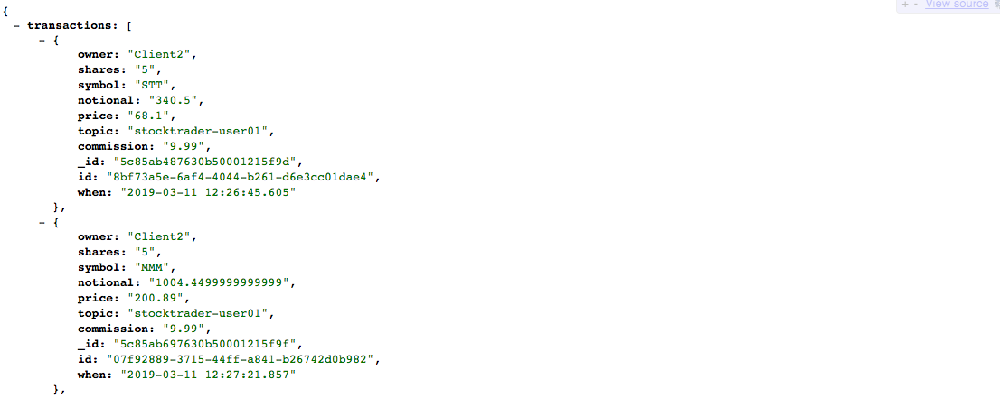

# Lab - Deploying a set of microservices in OpenShift

In this lab you will deploy and test the *IBM Stock Trader application* on Red Hat OpenShift.

The *IBM Stock Trader* application is a simple stock trading sample, written as a set of microservices where you can create various stock portfolios and add shares of stock to each for a commission. It keeps track of each porfolio’s total value and its loyalty level, which affect the commission charged per transaction. It also lets you submit feedback on the application, which can result in earning free (zero commission) trades, based on the tone of the feedback. (Tone is determined by calling the Watson Tone Analyzer).

The architecture of the  app is shown below:



The **portfolio** microservice sits at the center of the application. This microservice;

* persists trade data  using JDBC to a MariaDB database
* invokes the **stock-quote** service that invokes an API defined in API Connect in the public IBM Cloud to get stock quotes
* invokes the Tone Analyzer service in the public IBM Cloud to analyze the tone of submitted feedback
* sends trades to Kafka so that they can be recorded in Mongo by the **event-consumer** microservice
* calls the **trade-history** service to get aggregated historical trade  data.

**Tradr** is a Node.js UI for the porfolio service

The **event-consumer** service serves as a Kafka consumer and stores trade data published by the **portfolio** service in the Mongo database.

The **trade-history** service exposes an API to query the historical data in Mongo and is  called by the **portfolio** to get aggregated historical data.

The **stock-quote** service queries an external service to get real time stock quotes via an API Connect proxy.

This lab is broken up into the following steps:

1. [Login to the OpenShift Web Console and to the OpenShift CLI](#step-1-login-to-the-openshift-web-console-and-to-the-openshift-cli)

1. [Create a new project for the lab](#step-2-create-a-new-project-for-the-lab)

1. [Prepare for installation](#step-3-prepare-for-installation)

1. [Install all the prerequisites](#step-4-install-all-the-prerequisites)

1. [Install the StockTrader app](#step-5-install-the-stocktrader-app)

1. [Test the app](#step-6-test-the-app)

1. [Cleanup](#step-7-cleanup)

1. [Summary](#summary)


## Step 1: Login to the OpenShift Web Console and to the OpenShift CLI

1.1 In your browser go to the URL of  the OpenShift web console given to you by your instructor.

   

1.2 You will then be asked to log in with either `kube:admin` or `dragonslayer-ldap`. Select `dragonslayer-ldap` and log in using the same credentials you used to login to WeTTy.

1.3 From the OpenShift web console click on your username in the upper right and select **Copy Login Command**

   

1.4 You are prompted to login to the OpenShift console again. Repeat the same login procedure above to login.

1.5 Click **Display Token** link.

1.6 Copy the contents in the field **Log in with this token** to the clipboard. It provides a valid login command with a token.

1.7 If prompted with `Use insecure connections? (y/n):`, enter **y**.

1.8 Paste the login command in a terminal window and run it (Note: leave the web console browser tab open as you'll need it later on in the lab)

## Step 2: Create a new project for the lab

2.1 Set an environment variable for your *studentid* based on your user identifier from the instructor (e.g. **user001**)

   ```bash
   export STUDENTID=userNNN
   ```
2.2 Create a new OpenShift project for this lab

   ```bash
    oc new-project mcsvcs-$STUDENTID
   ```

## Step 3: Prepare for installation

Like a typical  Kubernetes app, Stock Trader use secrets and ConfigMaps to store information needed by one  or more microservices to access external  services and other microservices. We've  provided that info in a file hosted in Cloud Storage and there is a script that you'll use to retrieve it.

3.1 From a terminal window clone the Github repo that has everything needed to deploy the aggregated Stock Trader app.

```text
git clone https://github.com/IBMStockTraderLite/stocktrader-openshift4.git
cd stocktrader-openshift4
```

3.2 Retrieve credentials and other details needed to create secrets and/or ConfigMaps. Ask you instructor for the **SETUPURL** for the command below.

   ```bash
   # Note you must be in the scripts sub folder or this command will fail
   cd scripts

   # Your instructor will provide your with values for SETUPURL adn  STUDENID
   ./setupLab.sh SETUPURL $STUDENTID
   ```

3.3 Verify that the output looks something like the following:

   ```console
    Script being run from correct folder
    Validating URL to setup files ...
    Validating student id  ...
    Retrieving setup files ...
    Getting application  subdomain for cluster  ...
    Updating OpenShift template with shared host for all routes: stocktrader-microservices.apps.ocp.kubernetes-workshops.com
    Using stocktrader-user001 as Kafka topic name ...
    Updating variables.sh with Kafka topic : stocktrader-user001
    Setup completed successfully
   ```

3.4 Also verify that there is now a file called **variables.sh** in the current folder

## Step 4: Install all the prerequisites

In this part  you'll install the prereqs step by step before installing the Stock Trader application.

4.1 Install MariaDB by running the following command. Verify that no errors are displayed by the installation script.

   ```bash
   ./setupMariaDB.sh
   ```

4.2 Install Mongo by running the following command. Verify that no errors are displayed by the installation script.

   ```bash
   ./setupMongo.sh

   ```

4.3 Create the DNS Proxy and store all the  access information as secrets  for the  external Kafka installation. Verify that no errors are displayed by the script.

   ```bash
   ./setupKafka.sh

   ```

4.4 Store all the  access information as secrets for the API Connect proxy to the external  realtime stock quote . Verify that no errors are displayed by the script.

   ```bash
   ./setupAPIConnect.sh

   ```

4.5 Store all the  access information as secrets for the  external  Watson Tone Analyzer service . Verify that no errors are displayed by the script.

   ```bash
   ./setupWatson.sh

   ```

4.6 Verify your progress so far. Run the following to see the pods you have so far

   ```bash
   oc get pods
   ```

   The output should show pods for MariaDB and Mongo and they both should be running and in the READY state

   ```console
       NAME              READY     STATUS    RESTARTS   AGE
     mariadb-1-shzjl   1/1       Running   0          2m
     mongodb-1-gqpln   1/1       Running   0          2m
   ```

4.7 Initialize the MariaDB transactional database with some data. Verify that no errors are displayed by the script.

   ```text
   ./initDatabase.sh

   ```

4.8 Next look at your services

   ```bash
   oc get svc
   ```

4.9 Verify that the output shows services for Mongo, MariaDB and your DNS proxy to Kafka

  ```console
  NAME              TYPE           CLUSTER-IP      EXTERNAL-IP
  kafka-dns-proxy   ExternalName   <none>          broker-0-0mqz41lc21pr467x.kafka.svc01.us-south.eventstreams.cloud.ibm.com
  mariadb           ClusterIP      172.30.103.15   <none>
  mongodb           ClusterIP      172.30.235.11   <none>
  ```

## Step 5: Install the StockTrader app

In this part  you'll install all the Stock Trader microservices using a template  for all the microservices. Note that all the  microservices require some of the information stored via secrets in the scripts you ran in the previous section.

5.1 Go back to the top level folder of the  cloned repo

   ```bash
   cd ..
   ```

5.2 Install the microservices chart. Verify that no errors are displayed

   ```bash
   oc process -f templates/stock-trader.yaml | oc create -f -
   ```

5.3 Verify that all the pods are running and are in the READY state. Note you may have to run this command multiple times before all the pods become READY.

   ```bash
   oc get pods
   ```

5.4 Keep running the command  until the output looks something like this:

   ```console
   NAME                             READY     STATUS    RESTARTS   AGE
   event-streams-consumer-1-455pj   1/1       Running   0          2m
   mariadb-1-shzjl                  1/1       Running   0          2d
   mongodb-1-gqpln                  1/1       Running   0          2d
   portfolio-1-vkxnp                1/1       Running   0          2m
   stockquote-1-zck9n               1/1       Running   0          2m
   trade-history-1-5pngp            1/1       Running   0          2m
   tradr-1-qdps9                    1/1       Running   0          2m
   ```

5.5 The app uses OpenShift routes to provide access outside of the cluster. Use the following command to get the external hostnames you'll need to access Stock Trader.

   ```bash
   oc  get routes
   ```

5.6 Verify the output looks something like the following. The value in the  HOST/PORT column is the common hostname used for all the  microservices. The value in the PATH column is the unique path for each microservice.

   ```console
   NAME            HOST/PORT                                                     PATH             SERVICES
   portfolio       stocktrader-microservices.apps.ocp.kubernetes-workshops.com   /portfolio       portfolio
   stockquote      stocktrader-microservices.apps.ocp.kubernetes-workshops.com   /stock-quote     stockquote
   trade-history   stocktrader-microservices.apps.ocp.kubernetes-workshops.com   /trade-history   trade-history
   tradr           stocktrader-microservices.apps.ocp.kubernetes-workshops.com   /tradr           tradr
   ```

In this example the URL for the **tradr** UI is http://stocktrader-microservices.apps.ocp.kubernetes-workshops.com/tradr (the common hostname plus the PATH for **tradr**).

## Step 6: Test the app

In this part you'll verify that the various microservices are working as designed.

6.1 Bring up the **tradr** web application using the hostname you noted at the end of the  previous  section



6.2 Log in with the following credentials (note these are the only values that will work)

   ```text
   username: stock
   password: trader
   ```



6.3 Click **Add Client** and name the client `Client2`. Click **OK**



6.4 Click on the link in the **Name** column to see the  details of Client2

6.5 Do 3 or 4 "Buy" operations with different stock tickers (e.g. STT, T, GOOG, IBM).



6.6 Sell part of one of the holdings you just bought and verify that the table is updated appropriately

6.7 Click on **Feedback** and submit some client feedback. If the client sounds really angry they'll get 3 free trades otherwise they'll get one free trade.



6.8 Verify that the data flow of `portfolio->Kafka->event-consumer->trade-history-Mongo` works by querying the **trade-history** service via an endpoint  that makes it do a Mongo query.  Add the path `/trades/Client2` to the  route for the **trade-history** microservice. For example `http://stocktrader-microservices.apps.ocp.kubernetes-workshops.com/trade-history/trades/Client2` for the route used in the example above.

6.9 Enter the URL in another browser tab and verify that the history has captured  all the  trades you did while testing. A partial screen shot of what you should get back is shown below:



## Step 7: Cleanup

Free up resources for subsequent labs by deleting the Stock Trader app.

7.1 Run the following commands to cleanup (note: you can copy all the commands at once and post then into you command window)

   ```bash
   cd scripts
   oc delete dc,svc,routes --selector app=stock-trader
   ./cleanupWatson.sh
   ./cleanupAPIConnect.sh
   ./cleanupKafka.sh
   ./cleanupMongo.sh
   ./cleanupMariaDB.sh
   cd -
   ```

## Summary

You installed and then tested the  Stock Trader microservices sample application and got some insight into the challenges of deploying microservices apps in an OpenShift cluster.
