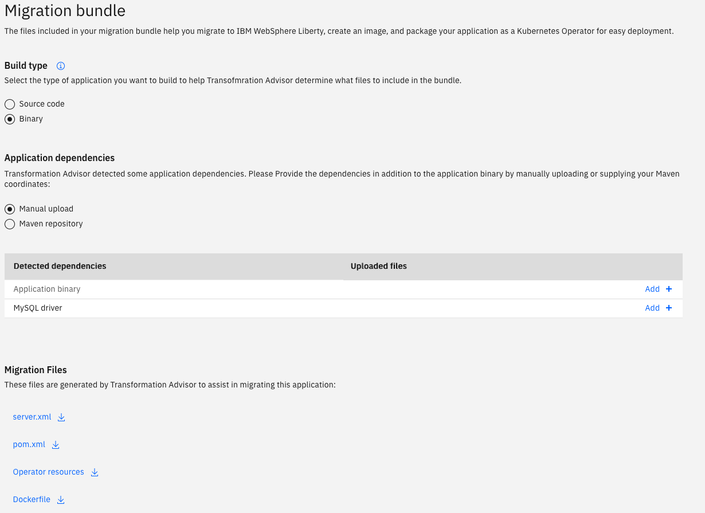

# IBM Client Developer Advocacy App Modernization Series

## Lab - Migrating Legacy JEE apps to OpenShift

### Working with IBM Cloud Transformation Advisor

## Overview

IBM Cloud Transformation Advisor helps you access, analyze and modernize middleware based apps for deployment on OpenShift. It categorizes Java EE apps and MQ queue managers as simple, medium and complex based on migration complexity and provides guidance for modernization. Transformation Advisor is  included as a web app with [IBM Cloud Pak for applications](https://www.ibm.com/cloud/cloud-pak-for-applications/get-started) and is also available to be run in [a local Docker environment](https://www.ibm.com/cloud/garage/tutorials/install-ibm-transformation-advisor-local).

Transformation Advisor analyzes the applications running on the following middleware:

**Java EE application servers**
- WebLogic Server V6.0 – V11.0
- IBM WebSphere® Application Server V7.0, or later
- Apache Tomcat V6.0 (and later)
- Java applications running in a JVM

**Messaging**
- IBM MQ V7, or later

In this short lab you'll run Transformation Advisor installed on OpenShift against the data collected from an instance of WebSphere Application Server V8.5.5 and examine the recommendations provided for a different Java EE applications. You'll  then look at the artifacts generated for one  those apps (the later version of the WebSphere sample app Plants By WebSphere)  for deployment on a Liberty container running in Kubernetes using the migration bundle  generated for this app by Transformation Advisor.

### Step 1: Launch Transformation Advisor and import data collected from  WebSphere Application Server

Transformation Advisor organizes your legacy server scans into workspaces and collections. Specific server scans are typically put into to separate collections. You'll use a completed server scan as a starting point for the lab

1. Download the server scan by right clicking on [this link](https://github.com//IBMAppModernization/app-modernization-ta-explore-lab/raw/master/ta/AppSrv01.zip) and selecting **Save Link As** from the context menu to save the file locally.

2. Access Transformation Advisor by following the URL given to you by the instructor. You will then be asked to log in with either `kube:admin` or `dragonslayer-ldap`. Select `dragonslayer-ldap` and log in using credentials provided to you by your instructor. 

3. Once logged into Transformation Advisor, click on **Add a new workspace**

4. Enter a unique name for your workspace e.g. `usernnn_ta_workspace` where `usernnn` is your assigned  student  ID (e.g. `user011`)

5. Click **Next** and enter a name for the collection e.g. `lab_collection`

6. Click **Let's go**

7. At this point you have the option of downloading a data collection script for your legacy server to collect the data about all the installed applications or upload the results of a data collection script. Click **Upload data** then click **Drop or Add File** and select the file **AppSrv01.zip** you downloaded previously.

    

8. Click **Upload** to upload the file

9. You should be presented with a summary of recommendations for 4 applications running on the WebSphere Application Server instance where the data collection script was run.

   

### Step 2: Explore the report generated by Transformation advisor

1. Lets look at the apps designated with red to indicate that changes to the app are required before running the app on WebSphere Liberty. Click on the link for the app **petstore-WAS.ear**. This is a Java EE 5 app written by the Java BluePrints program that validates several Java EE 5 features.

    

2. Scroll down to the bottom of the page and click on **Analysis Report**. Click **OK** when prompted.

3. The analysis will open up in a new browser tab. Scroll down to the section with title **Detailed Results by Rule** and click on **Show rule help** next to the rule named **The JSF SunRI engine was removed** to see more details about what needs to be fixed to migrate the Java Pet Store app to WebSphere Liberty running on OpenShift. Take a look at some of the  other information in the report to get a feel for what type of information to expect when running Transformation Advisor against your own legacy Java EE apps.

    

4. Go back to the **IBM Cloud Transformation** browser tab, scroll to the top of the page, and click on **Recommendations /** to go back to the list of apps.

    

5. This time take a look at one of the "show stoppers" for the app **plants-by-websphere-jee5.ear** by selecting the app and then clicking on the Analysis Report link. This version of the  WebSphere sample Plants by WebSphere was shipped with WebSphere Application Server V7.0. Two  of the  three severe issues have to do with no support for the JAX-RPC API in Liberty. Note: with the explosion of REST based APIs, technologies like JAX-RPC and SOAP/WSDL have become more or less obsolete.

6. Go back to the **IBM Cloud Transformation** browser tab, scroll to the top of the page, and click on **Recommendations /** to go back to the list of apps.

7. Now you'll look at the migration plan for the app **plants-by-websphere-jee6-mysql.ear**. This is the Plants By WebSphere  app that comes with WebSphere Application Server 8.5.5 and  has been tweaked to work with the MySQL database instead of the  embedded Apache Derby database that the original uses. Note that this version uses JAX-RS (the Java API for RESTful Web Services) instead of JAX-RPC and JAX-RS is fully supported on WebSphere Liberty. Click on three dot menu button to the right of **plants-by-websphere-jee6-mysql.ear** and then select **Migration plan** as shown below

    

8. On this page you can decide how you want to recieve the output of Transformation Advisor. You have two options for what you want included in the bundled output:
- **Source Code:** The application code is included in the bundle so that you can make tweaks to your application before deployment.
- **Binary:** The application binaries are included in the bundle if you want to deploy without changes to the application. 

Most applications will require some tweaks to the source code in order for it to be deployable.

With **Source Code** selected as your build type you will notice a list of files that are generated for you by Transformation Advisor to aid the migration of the app to Liberty running in Kubernetes. This includes:
- **server.xml:** WebSphere Liberty configurations 
- **pom.xml:** Maven build configuration
- **Operator resources:** Files needed to deploy an [Operator](https://www.redhat.com/en/blog/introducing-operator-framework-building-apps-kubernetes) to your Kubernetes cluster to manage your application.
- **Dockerfile:** Docker container build instructions

If you select **Binary** as your build type, you will then need to provide Application Dependencies including the **Aplication Binary** and the **MySQL driver**. These will then be added to your migration bundle along with the files mentioned above. 

Lastly, Transformation Advisor gives you the choice to either download or send your migration bundle to a git repository by selecting either of the respective **Download** or **Send to Git** buttons in the bottom right of the page. 

Don't worry about doing anything with this bundle right now. In a later lab we will explore how to deploy the application.

## Summary

You've gone through the process of evaluating various legacy  WebSphere Application Server apps for  migration  to a containerized version running on WebSphere Liberty in Kubernetes.
