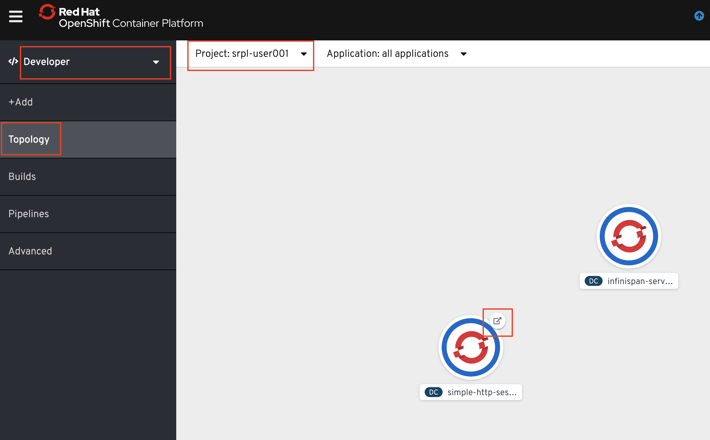
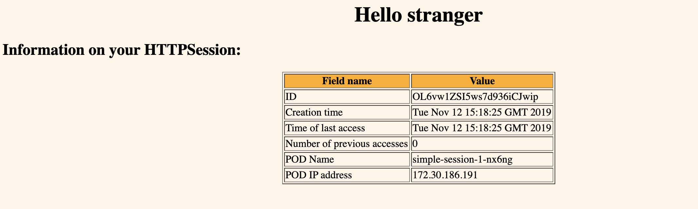
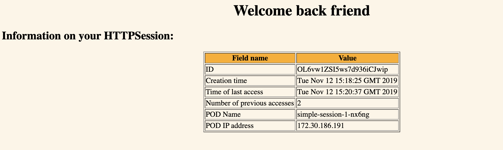

# Lab - HTTPSession replication in WebSphere Liberty on OpenShift

WebSphere Liberty has a feature called **sessionCache-1.0** which provides distributed in-memory HttpSession caching. The **sessionCache-1.0** feature builds on top of an existing technology called JCache (JSR 107), which offers a standardized distributed in-memory caching API. However, even though the feature builds on top of JCache, no direct usage of JCache API is necessary in your application, since Liberty handles the session caching in its HttpSession implementation. In fact, if your application is already using HttpSession caching, it can benefit from **sessionCache-1.0 without making any code changes.**

In this lab you'll use these  capabilities  to deploy and test  a small Java EE app on OpenShift. You'll use an Open Source JCache provider called [Infinispan](https://infinispan.org) to provide the implementation of the JCache support that is included in Liberty. Note that any compliant JSR 107 product can be used in this manner with WebSphere Liberty.

This lab is broken up into the following steps:

1. [Logon into the OpenShift Web Console and to the OpenShift CLI](#step-1-login-to-the-openshift-web-console-and-to-the-openshift-cli)

1. [Create a new project for the lab](#step-2-create-a-new-project-for-the-lab)

1. [Install the sample app and Infinispan server](#step-3-install-the-sample-app-and-infinispan_server)

1. [Test the sample app](#test-the-sample-app)

1. [Cleaup](#cleanup)

1. [Summary](#summary)


### Step 1: Login to the OpenShift Web Console and to the OpenShift CLI

1.1 In your browser go to the URL of  the OpenShift web console given to you by your instructor.

   

1.2 You will then be asked to log in with either `kube:admin` or `dragonslayer-ldap`. Select `dragonslayer-ldap` and log in using the same credentials you used to login to WeTTy.

1.3 From the OpenShift web console click on your username in the upper right and select **Copy Login Command**

   

1.4 You are prompted to login to the OpenShift console again. Repeat the same login procedure above to login.

1.5 Click **Display Token** link.

1.6 Copy the contents in the field **Log in with this token** to the clipboard. It provides a valid login command with a token.

1.7 If prompted with `Use insecure connections? (y/n):`, enter **y**.

1.8 Paste the login command in a terminal window and run it (Note: leave the web console browser tab open as you'll need it later on in the lab)

### Step 2: Create a new project for the lab

2.1 Set an environment variable for your *studentid* based on your user identifier from the instructor (e.g. **user001**)

```bash
export STUDENTID=userNNN
```
2.2 Create a new OpenShift project for this lab

```bash
oc new-project srpl-$STUDENTID
```

### Step 3: Install the sample app and Infinispan server

3.1  From the client terminal window run the following command to install the Infinispan server

   ```bash
oc new-app --docker-image=infinispan/server --name=infinispan-server \
-e USER="sampleUser" -e PASS="samplePassword"
   ```

3.2 From the client terminal window run the following command to install the sample app

   ```bash
oc new-app --docker-image=clouddragons/simple-http-session-app \
--name=simple-http-session-app \
-e INFINISPAN_HOST="infinispan-server" -e INFINISPAN_USER="sampleUser" \
-e INFINISPAN_PASSWORD="samplePassword"
   ```
3.3 From the client terminal window run the following command to expose the endpoint of the sample app by creating a route

   ```bash
   oc expose svc/simple-http-session-app
   ```

3.4 From the client terminal window run the following command to scale up the sample app to 2 replicas

   ```bash
   oc scale --replicas=2 dc simple-http-session-app
   ```   

3.5 In your Web console browser tab make sure you've selected  the **Developer** tab (top left), the correct project is selected and  you're looking at the  **Topology**.

   

3.6 Wait for the icons for both deployments (infinispan server and sample app) to have a dark blue circle indicating that they're in the **READY** state

3.7 Click on the icon to launch the  sample app

   

### Step 4: Test the sample app

When you bring up the app in a new browser session the banner on the web page will say  **Hello stranger** and a  new HTTPSession object is created and is replicated to all the pods.  When the app encounters an existing HTTPSession object the banner message will change to **Welcome back friend**.  

4.1 When the app appears in your browser verify that the banner says  **Hello stranger**

   

4.2 Keep refreshing the URL and verify that the POD IP address stays the same. This is because the default behavior of the route is to return to the pod where the session was created (ie sticky sessions).

4.3 From the client terminal window run the following command to disable sticky sessions

   ```bash
   oc annotate route simple-http-session-app \
   haproxy.router.openshift.io/disable_cookies=true
   ```

4.4 In your browser, keep refreshing the  app URL and verify that the POD IP address changes and the current state of the  session data is maintained and used by all pods (i.e. the banner should say **Welcome back friend**  and the access count should keep incrementing). Keep this browser tab open as you'll need it for further testing.

   

4.5 Next you'll verify that if you increase the number of replicas the new replicas will automatically access the shared session state. From your terminal run the following command

   ```bash
   oc scale --replicas=3 dc simple-http-session-app
   ```   

4.6 In your OpenShift Web console browser tab return to   **Topology**. Wait for the icon for the sample app to have a dark blue circle indicating that all pods are in the **READY** state

4.7 Go back to the browser tab where you had the **simple-session** app running and keep refreshing the page. Verify that the 3rd pod is now being accessed and that the access count is never reset to 0.

## Cleanup

Run the following commands to cleanup (note: you can copy all the commands at once and post them into your command window)

   ```bash
   oc delete svc,dc,route,is simple-http-session-app
   oc delete svc,dc,is infinispan-server
   oc delete is open-liberty
   ```

## Summary
Congratulations. You used the **session-cache** feature in WebSphere Liberty along with the Open Source **Infinispan Data Grid** to demonstrate HttpSession replication in OpenShift. This allowed you to  deploy  a stateful application in a stateless manner (i.e each application pod can be deleted or replaced at anytime without losing application state).
